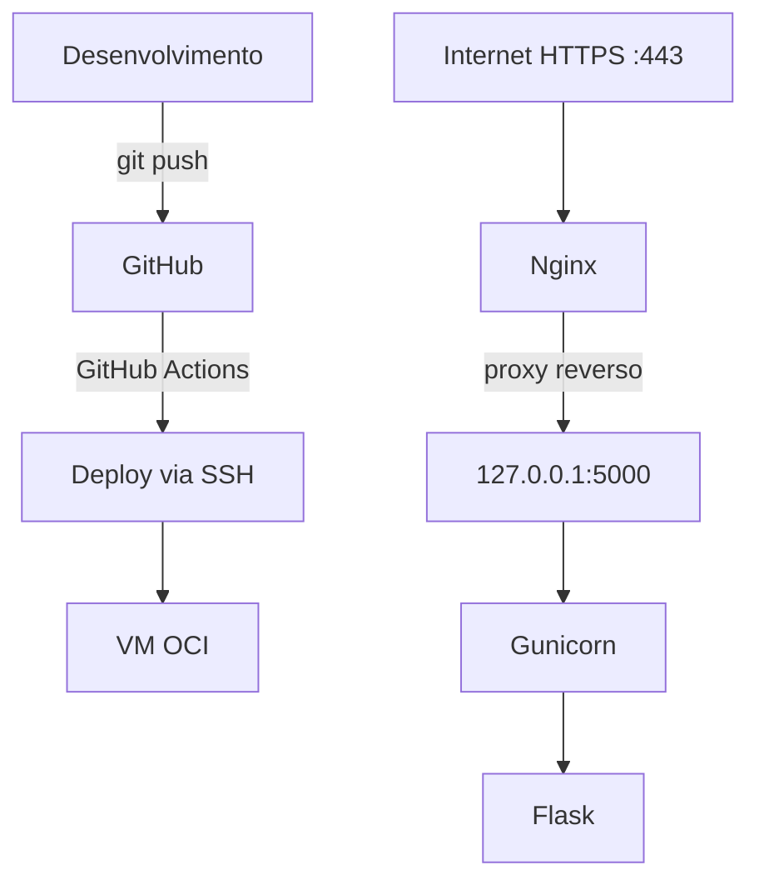
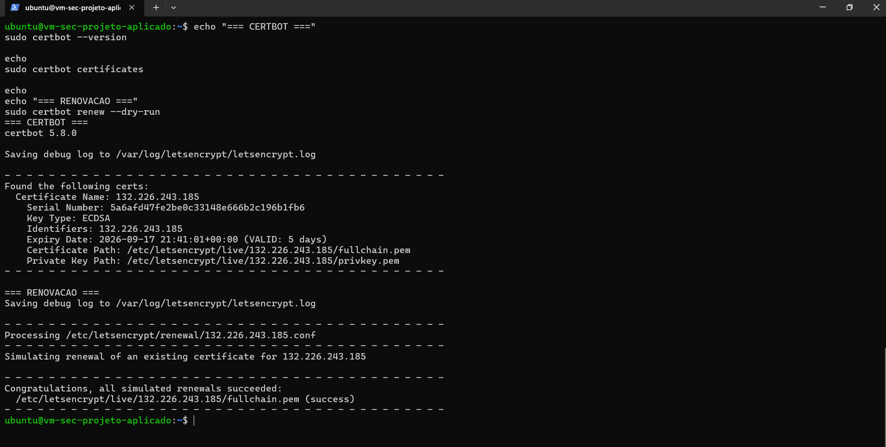
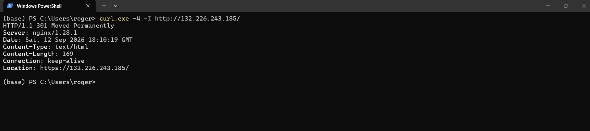
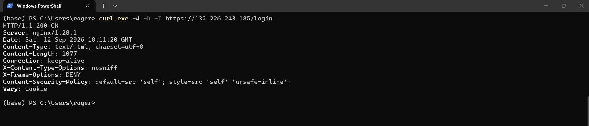
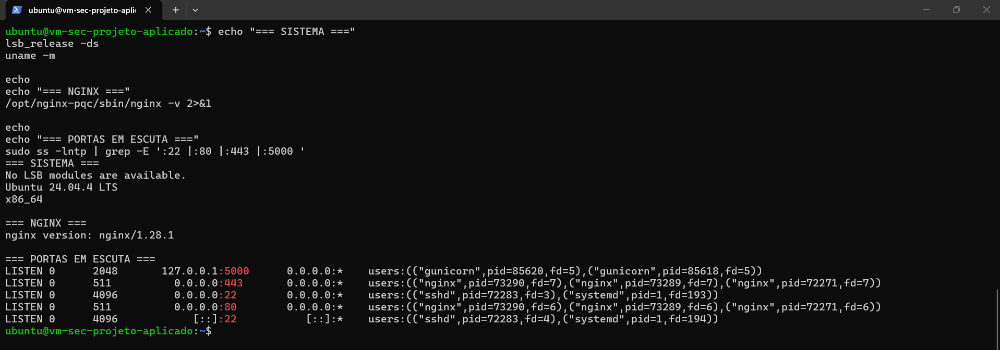
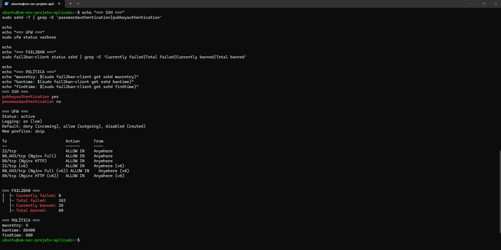
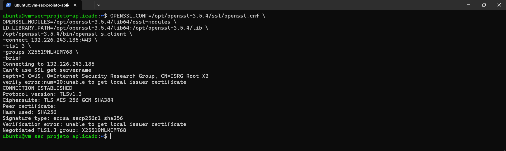
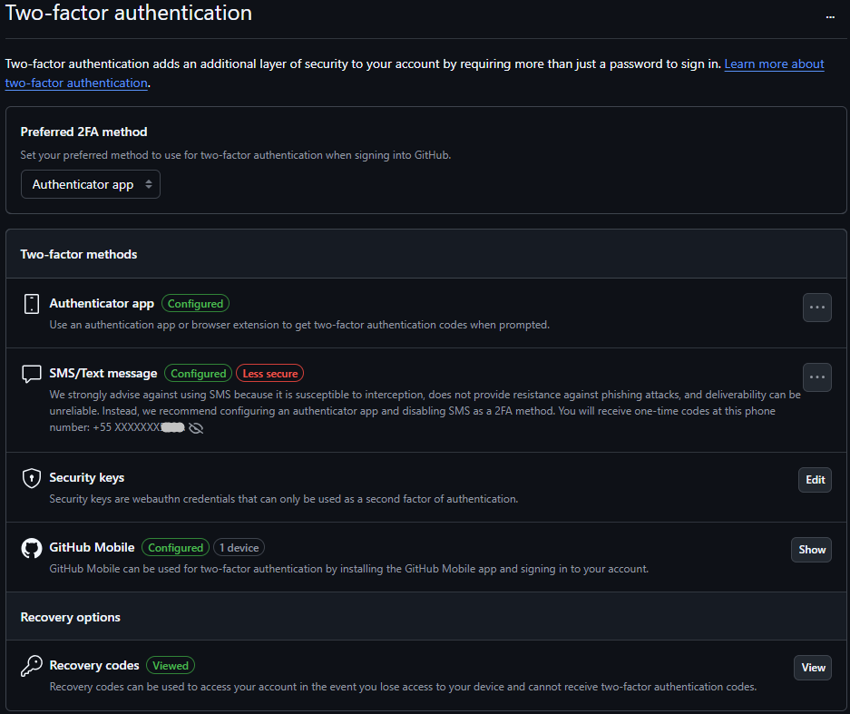

# Projeto Aplicado: Práticas de Mercado

Protótipo de aplicação web segura desenvolvido para a disciplina **Projeto Aplicado: Práticas de Mercado**, do curso de pós-graduação Lato Sensu em **Segurança da Informação e Análise Forense (UNCISAL - 2025.2)**.

O projeto aplica **Secure by Design** e **Secure by Default** em uma aplicação Flask publicada na Oracle Cloud Infrastructure (OCI), protegida por Nginx, HTTPS, autenticação por sessão e CI/CD.

## Arquitetura



- **Aplicação:** Flask em [app.py](app.py).
- **Views:** [templates/login.html](templates/login.html) e [templates/dashboard.html](templates/dashboard.html).
- **Servidor:** Gunicorn gerenciado por `meu-projeto.service`.
- **Proxy reverso:** Nginx encaminhando para `127.0.0.1:5000`.
- **Infraestrutura:** OCI Always Free, região `sa-saopaulo-1`.
- **Servidor:** Ubuntu Server 24.04 LTS, `VM.Standard.E2.1.Micro`, 1 GB de RAM.
- **IP público:** `132.226.243.185`.

## Segurança da aplicação

### OWASP Top 10:2025

#### A01:2025 — Broken Access Control

- `/dashboard` exige autenticação por `@login_required`.
- Usuários sem sessão são redirecionados para `/login`.
- O logout executa `session.clear()`.
- Após o logout, `/dashboard` retorna `HTTP 302 FOUND` com `Location: /login`.

#### A02:2025 — Security Misconfiguration

- Cookie de sessão com `HttpOnly`, `SameSite=Lax` e `Secure` em produção.
- Nome da sessão definido como `session_sec`.
- Headers `X-Content-Type-Options`, `X-Frame-Options` e Content Security Policy.
- `SECRET_KEY` obrigatória e fornecida por variável de ambiente.
- Serviço interno em `127.0.0.1:5000`, sem exposição direta da porta 5000.

#### A04:2025 — Cryptographic Failures

- Senha validada com `check_password_hash()`.
- Segredos fora do código, fornecidos por variáveis de ambiente e GitHub Secrets.
- Tráfego protegido por HTTPS e TLS 1.3.
- Grupo híbrido `X25519MLKEM768` negociado em teste externo.

> O certificado Let's Encrypt é ECDSA. O suporte PQC refere-se à negociação de chaves TLS, não ao certificado.

## Infraestrutura e hardening

- OCI Security List e UFW restringindo a exposição às portas `22`, `80` e `443`.
- SSH somente por chave, com autenticação por senha desabilitada.
- Fail2Ban protegendo SSH com `maxretry=4` e `bantime=86400`.
- HTTP redirecionado para HTTPS com `301`.
- Certbot configurado para renovação do certificado, com validação do processo realizada por meio de `certbot renew --dry-run`.
- OpenSSL 3.5.4 instalado isoladamente em `/opt/openssl-3.5.4`.
- Nginx 1.28.1 compilado com OpenSSL 3.5.4 em `/opt/nginx-pqc`.

## Evidências de Segurança

As evidências abaixo documentam os principais controles de segurança implementados na infraestrutura e na aplicação. As imagens são apresentadas na sequência de validação do serviço, desde a emissão do certificado até a proteção da conexão TLS.

### 1. Certbot e renovação do certificado

A evidência demonstra a instalação e a configuração do Certbot para renovação do certificado Let's Encrypt emitido para o endereço IP público. O comando `certbot renew --dry-run` foi executado com sucesso e valida o processo de renovação, mas não comprova que uma renovação real já ocorreu. O mecanismo de agendamento automático não está documentado como evidência.



### 2. Redirecionamento HTTP para HTTPS

A evidência demonstra o redirecionamento automático do tráfego HTTP para HTTPS por meio de uma resposta `HTTP 301 Moved Permanently`, direcionando o acesso para comunicação protegida.



### 3. HTTPS e cabeçalhos de segurança

A evidência demonstra o acesso HTTPS ao endpoint `/login`, com resposta `HTTP 200` e presença dos cabeçalhos defensivos utilizados pela aplicação: `X-Content-Type-Options: nosniff`, `X-Frame-Options: DENY` e `Content-Security-Policy`. A resposta também identifica o Nginx como servidor da camada de entrada.



### 4. Nginx, aplicação e portas

A evidência demonstra o ambiente Ubuntu 24.04 LTS, o Nginx 1.28.1, as portas `80` e `443` expostas pelo Nginx, o SSH na porta `22` e a aplicação Gunicorn escutando somente em `127.0.0.1:5000`. A porta 5000 não fica diretamente exposta à Internet; o Nginx atua como camada de entrada e proxy reverso.



### 5. SSH, firewall e Fail2Ban

A evidência demonstra as medidas de proteção da administração do servidor: autenticação SSH por chave pública, autenticação por senha desabilitada, UFW ativo, portas necessárias liberadas e Fail2Ban ativo para proteção do SSH. A política apresentada utiliza quatro tentativas em uma janela de 10 minutos, com duração de banimento de 24 horas. Nenhuma lista de endereços IP banidos é reproduzida neste documento.



### 6. TLS 1.3 e pós-quântica

A evidência demonstra uma conexão TLS 1.3 utilizando o grupo híbrido pós-quântico `X25519MLKEM768` para a troca de chaves. Esse identificador corresponde ao grupo de troca de chaves híbrida pós-quântica; o certificado utilizado continua sendo ECDSA. Portanto, a evidência não deve ser interpretada como um certificado pós-quântico.

```text
Protocol version: TLSv1.3
Ciphersuite: TLS_AES_256_GCM_SHA384
Negotiated TLS1.3 group: X25519MLKEM768
```



O resultado da Grade A e da indicação de PQC no SSL Labs ainda precisa ser capturado diretamente no relatório do SSL Labs. A consulta automática realizada nesta etapa retornou `400` e não é tratada como evidência.

## CI/CD

O workflow [`.github/workflows/deploy.yml`](.github/workflows/deploy.yml) é executado em pushes para `main` e:

1. Obtém o código com `actions/checkout`.
2. Gera temporariamente o arquivo de ambiente a partir dos GitHub Secrets.
3. Transfere a aplicação via SCP/SSH.
4. Instala o ambiente virtual e as dependências.
5. Instala o ambiente em `/etc/meu-projeto.env` com permissão `600`.
6. Reinicia e valida `meu-projeto.service`.
7. Testa o endpoint local `/login`.

Secrets utilizados: `APP_SECRET_KEY`, `APP_ADMIN_USERNAME`, `APP_ADMIN_PASSWORD_HASH`, `OCI_SSH_KEY` e `OCI_VM_IP`.

## Evidências funcionais

- Login com credenciais válidas: aprovado.
- Criação da sessão `session_sec`: aprovada.
- Acesso autenticado ao `/dashboard`: aprovado.
- Acesso sem autenticação: bloqueado.
- Logout e invalidação do cookie: aprovados.
- Acesso após logout: redirecionado para `/login` com `302`.
- Deploy real validado no commit `8dff79a`, com pipeline concluído com sucesso.
- Serviço `meu-projeto.service`: ativo em produção.

## Repositório seguro

O arquivo [`.gitignore`](.gitignore) exclui ambientes virtuais, `.env`, chaves privadas, cookies, bancos locais, caches e logs. A auditoria do histórico não identificou chaves privadas, credenciais ou valores concretos dos secrets; foram encontradas apenas referências aos nomes dos GitHub Secrets utilizados pelo workflow.

### 2FA da conta GitHub

A evidência comprova a ativação da autenticação em dois fatores (2FA) na conta GitHub utilizada no projeto, atendendo ao requisito de segurança previsto no Eixo 2. A configuração utiliza o **Authenticator app** como método preferencial e possui o **GitHub Mobile** configurado como método adicional. Informações pessoais de contato foram ocultadas antes da publicação da evidência no repositório público.



## Execução local

### Pré-requisitos

- Python 3.10 ou superior.
- `SECRET_KEY` e `ADMIN_PASSWORD_HASH` configuradas no ambiente.

```powershell
python -m venv venv
venv\Scripts\Activate.ps1
pip install -r requirements.txt
$env:SECRET_KEY = "chave-local-de-desenvolvimento"
$env:ADMIN_USERNAME = "admin"
$env:ADMIN_PASSWORD_HASH = "hash-gerado-com-werkzeug"
python app.py
```

A aplicação local ficará disponível em `http://127.0.0.1:5000/`.

## Uso de IA no desenvolvimento

O desenvolvimento e a revisão do projeto receberam apoio do **GitHub Copilot no VS Code**, utilizado como ferramenta de assistência de IA similar ao ambiente indicado no escopo acadêmico. O apoio foi aplicado à escrita e revisão do código Flask, configuração do workflow de CI/CD, análise de controles OWASP, diagnóstico de testes e organização da documentação.

As sugestões foram revisadas pelo responsável pelo projeto. Comandos, configurações e resultados foram validados no ambiente local, no pipeline do GitHub Actions e na infraestrutura real antes de serem registrados como evidência.

## Checklist de entrega

| Item | Situação |
| --- | --- |
| OCI, Ubuntu, IP público, Nginx e HTTPS | Comprovado |
| Certbot configurado e renovação validada com `--dry-run` | Comprovado; mecanismo de agendamento automático ainda não documentado |
| TLS 1.3 e `X25519MLKEM768` | Comprovado |
| Grade A e indicação PQC no SSL Labs | Pendente de captura |
| GitHub público e GitHub Actions | Comprovado |
| `.gitignore` e ausência de arquivos sensíveis rastreados | Comprovado |
| Auditoria de padrões de segredo no histórico | Sem ocorrência concreta encontrada |
| Login, sessão, dashboard e logout | Comprovado |
| OWASP A01, A02 e A04 | Comprovado |
| Evidência de uso de IA/Antigravity ou ferramenta similar | Comprovado no uso do GitHub Copilot no VS Code |
| 2FA do GitHub | Comprovado |

---

Trabalho acadêmico desenvolvido para a pós-graduação em Segurança da Informação e Análise Forense - CED / UNCISAL.
