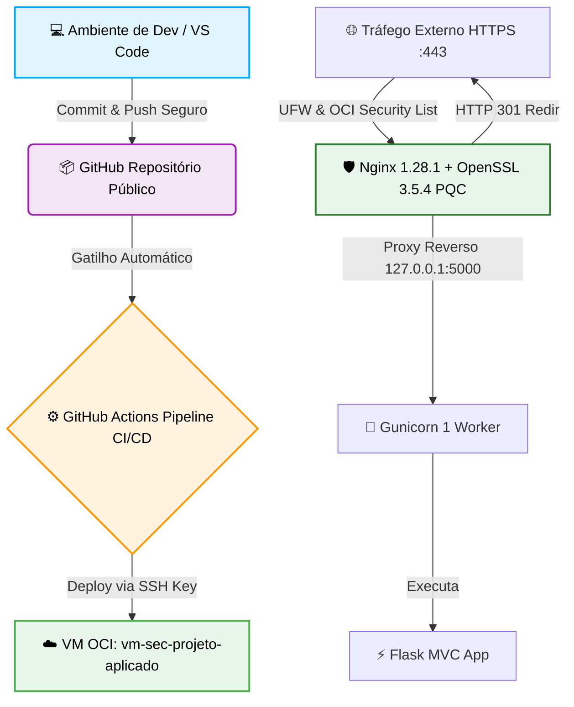

# 🛡️ Relatório Técnico: Projeto Aplicado - Práticas de Mercado
Este repositório contém o código-fonte, a documentação e os arquivos de configuração de infraestrutura do protótipo desenvolvido para a disciplina de **Projeto Aplicado: Práticas de Mercado** do curso de pós-graduação Lato Sensu em **Segurança da Informação e Análise Forense (UNCISAL - 2025.2)**.

O projeto foi construído seguindo rigorosamente os princípios de **Secure by Design** e **Secure by Default**, integrando desenvolvimento web seguro (arquitetura MVC em Flask), infraestrutura em nuvem blindada (Oracle Cloud Infrastructure) com suporte pioneiro à **Criptografia Pós-Quântica (PQC)** e automação de certificados para IP público.

---

## 📑 Sumário

1. [Introdução](https://notebook.google.com/#1-introdu%C3%A7%C3%A3o)
2. [Arquitetura da Solução](https://notebook.google.com/#2-arquitetura-da-solu%C3%A7%C3%A3o)
3. [Princípios de Secure by Design](https://notebook.google.com/#3-princ%C3%ADpios-de-secure-by-design)
4. [Controles de Secure by Default](https://notebook.google.com/#4-controles-de-secure-by-default)
5. [Implementação da Criptografia Pós-Quântica (PQC)](https://notebook.google.com/#5-implementa%C3%A7%C3%A3o-da-criptografia-p%C3%B3s-qu%C3%A2ntica-pqc)
6. [Gestão de Certificados e Identidade Web](https://notebook.google.com/#6-gest%C3%A3o-de-certificados-e-identidade-web)
7. [Hardening de Infraestrutura e Proteção Ativa](https://notebook.google.com/#7-hardening-de-infraestrutura-e-prote%C3%A7%C3%A3o-ativa)
8. [Dossiê de Evidências Práticas e Testes](https://notebook.google.com/#8-dossi%C3%AA-de-evid%C3%AAncias-pr%C3%A1ticas-e-testes)
9. [Análise Crítica e Lições Aprendidas (SRE)](https://notebook.google.com/#9-an%C3%A1lise-cr%C3%ADtica-e-li%C3%A7%C3%B5es-aprendidas-sre)
10. [Limitações e Trabalhos Futuros](https://notebook.google.com/#10-limita%C3%A7%C3%B5es-e-trabalhos-futuros)
11. [Conclusão](https://notebook.google.com/#11-conclus%C3%A3o)

---

## 1. Introdução
O avanço das ameaças cibernéticas e a iminência da computação quântica exigem que novos sistemas sejam concebidos com barreiras defensivas profundas (*Defense in Depth*). Este projeto aplicado tem como objetivo projetar, implantar e homologar um servidor seguro e uma aplicação web resiliente, combinando infraestrutura em nuvem, controle estrito de acessos, proxy reverso otimizado e algoritmos de criptografia resistentes a ataques quânticos (*Harvest Now, Decrypt Later*).

---

## 2. Arquitetura da Solução
A infraestrutura foi implantada na nuvem pública da **Oracle Cloud Infrastructure (OCI)** na região de São Paulo (`sa-saopaulo-1`).

### 🖥️ Especificações do Servidor Principal

- **Nome da Instância:** `vm-sec-projeto-aplicado`
- **Sistema Operacional:** Ubuntu Server 24.04 LTS (x86_64 / AMD)
- **Formato de Computação (Shape):** `VM.Standard.E2.1.Micro` (1/8 OCPU, 1 GB de RAM)
- **Memória Swap:** 2 GiB alocados em disco para estabilidade durante tarefas de alta demanda.
- **Rede:** VCN `vcn-sec-projeto` (`10.0.0.0/16`) com Subnet pública `subnet-sec-projeto` (`10.0.1.0/24`) e IP público `132.226.243.185`.

### 🏗️ Diagrama de Fluxo e Componentes



---

## 3. Princípios de Secure by Design
A arquitetura foi planejada para mitigar riscos estruturais antes mesmo do início da codificação:

- **Isolamento da Aplicação:** O Flask não é exposto diretamente à internet. Ele roda localmente via Gunicorn na interface de loopback (`127.0.0.1:5000`), sendo acessível externamente apenas através do proxy reverso do Nginx.
- **Minimização da Superfície de Ataque:** Desativação de serviços desnecessários e restrição de portas abertas na borda.
- **Isolamento de Bibliotecas Críticas:** A biblioteca criptográfica OpenSSL 3.5.4 foi compilada em `/opt/openssl-3.5.4`, preservando intacto o OpenSSL 3.0.13 nativo do Ubuntu para garantir a estabilidade do sistema operacional (SSH, APT e serviços locais).

---

## 4. Controles de Secure by Default
Todos os componentes operam por padrão com as configurações mais restritivas possíveis:

- **Política de Firewall (UFW):** Entrada padrão bloqueada (`deny incoming`), saída liberada (`allow outgoing`). Portas estritamente abertas: `22/tcp` (SSH), `80/tcp` (HTTP) e `443/tcp` (HTTPS).
- **Autenticação SSH:** Acesso administrativo restrito a **autenticação por chave pública**, com autenticação por senha explicitamente desabilitada (`PasswordAuthentication no`).
- **Tráfego Criptografado Obrigatório:** Todo o tráfego HTTP na porta 80 é redirecionado permanentemente via `HTTP 301` para HTTPS na porta 443 (com exceção isolada para o desafio ACME do Certbot).
- **Restrição de Concorrência SRE:** Gunicorn limitado a 1 worker para atuar dentro dos limites de 1 GB de RAM sem risco de acionar o *Out-Of-Memory Killer* (OOM).

---

## 5. Implementação da Criptografia Pós-Quântica (PQC)
O grande diferencial técnico deste projeto é a capacitação do servidor para responder a conexões TLS utilizando algoritmos de troca de chaves pós-quânticos padronizados pelo NIST.

### ⚙️ Processo de Compilação Isolada

1. **OpenSSL 3.5.4:** Compilado e instalado isoladamente em `/opt/openssl-3.5.4`.
2. **Nginx 1.28.1:** Compilado apontando para as fontes do OpenSSL 3.5.4 e instalado em `/opt/nginx-pqc`.
3. **Configuração TLS 1.3:** Habilitação do protocolo estrito TLS 1.3 com ativação prioritária do grupo híbrido pós-quântico:

```nginx
ssl_protocols TLSv1.3;
ssl_prefer_server_ciphers off;
ssl_ecdh_curve X25519MLKEM768:X25519;
```

---

## 6. Gestão de Certificados e Identidade Web
O projeto utiliza a especificação mais recente da Let's Encrypt (GA 2026) para emissão de certificados SSL/TLS para endereços IP públicos:

- **Identificador:** Certificado emitido diretamente para o IP público `132.226.243.185`.
- **Perfil de Validade:** Utilização do perfil `shortlived` (validade estrita de ~6,7 dias / 160 horas), reduzindo drasticamente a janela de exposição em caso de comprometimento da chave.
- **Automação de Renovação:** Agendamento automatizado via Certbot com `deploy-hook` configurado para executar o reload limpo do Nginx (`systemctl reload nginx`).

---

## 7. Hardening de Infraestrutura e Proteção Ativa

### 🛡️ 1. Proteção de Rede e Borda (OCI + UFW)

- **OCI Security List:** Regras de entrada restritas às portas 22, 80 e 443.
- **Ubuntu UFW:** Firewall local ativo espelhando as regras da OCI.

### 🛡️ 2. Proteção Contra Força Bruta (Fail2Ban)
Instalação e configuração do Fail2Ban monitorando o daemon SSH (`sshd`):

- **Parâmetros:**
- `bantime = 86400` (Banimento por 24 horas)
- `findtime = 86400` (Janela de monitoramento de 24 horas)
- `maxretry = 4` (Tolerância máxima de 4 tentativas incorretas)
- **Impacto Prático:** Bloqueio automatizado de ataques de dicionário e varreduras maliciosas diretamente na tabela de firewall do sistema.

---

## 8. Dossiê de Evidências Práticas e Testes

### 🧪 Evidência 1: Redirecionamento HTTP → HTTPS (301)
Chamada de teste externa via porta 80:

```http
HTTP/1.1 301 Moved Permanently
Server: nginx/1.28.1
Location: https://132.226.243.185/
```

### 🧪 Evidência 2: Conexão HTTPS Externa (200 OK)
Execução de requisição HTTPS via `curl.exe`:

```http
HTTP/1.1 200 OK
Server: nginx/1.28.1
Content-Type: text/html; charset=utf-8
Content-Length: 343

<!DOCTYPE html>
<html lang="pt-BR">
<head><title>Projeto de Segurança da Informação</title></head>
<body>
        <h1>VM Sec Projeto</h1>
        <p>Aplicação Flask funcionando corretamente.</p>
        <p>Servidor: Oracle Cloud Infrastructure</p>
</body>
</html>
```

### 🧪 Evidência 3: Negociação Efetiva de Criptografia Pós-Quântica (PQC)
Validação de handshake no servidor com o OpenSSL 3.5.4:

```text
Protocol version: TLSv1.3
Ciphersuite: TLS_AES_256_GCM_SHA384
Negotiated TLS1.3 group: X25519MLKEM768
```
*A evidência confirma que o servidor e o cliente negociaram com sucesso o grupo híbrido **X25519MLKEM768**.*

### 🧪 Evidência 4: Status do Fail2Ban e Mitigação Ativa
Status retornado pelo cliente Fail2Ban na porta SSH:

- **Tentativas de invasão registradas:** 320 falhas
- **Total de IPs banidos:** 57 IPs
- **IPs ativamente bloqueados:** 26 IPs

### 🧪 Evidência 5: Teste de Renovação Automática do Certbot
Resultado do teste de simulação sem falhas:

```text
Processing /etc/letsencrypt/renewal/132.226.243.185.conf
Simulating renewal of an existing certificate for 132.226.243.185
Congratulations, all simulated renewals succeeded:
    /etc/letsencrypt/live/132.226.243.185/fullchain.pem (success)
```

---

## 9. Análise Crítica e Lições Aprendidas (SRE)

1. **Gestão Estruturada de Memória em Hardware Enxuto:** O limite de 1 GB de RAM da VM `VM.Standard.E2.1.Micro` exigiu decisões cuidadosas de engenharia: a criação de 2 GiB de Swap permitiu a compilação bem-sucedida do OpenSSL 3.5.4 e Nginx 1.28.1 sem travamento do SO por falta de memória.
2. **Segurança no Isolamento de Binários:** A compilação do OpenSSL 3.5.4 em `/opt/openssl-3.5.4` demonstrou a importância de isolar dependências críticas sem sobrescrever a versão padrão do sistema (`3.0.13`), preservando a funcionalidade de atualizações via APT e a conectividade SSH.

---

## 10. Limitações e Trabalhos Futuros
Embora o protótipo atinja todos os requisitos de segurança e infraestrutura exigidos no escopo acadêmico, identificou-se oportunidades de evolução para ambientes corporativos de grande escala:

- **Observabilidade Centralizada:** Integração do sistema de logs estruturados (JSON) do Flask (`structlog`) com agregadores como Grafana Loki ou Datadog.
- **Alta Disponibilidade e Contingência (HA/DR):** Configuração de um cluster secundário de contingência (*Warm Standby*) com sincronização de banco de dados e chaveamento por DNS.
- **Testes Automatizados de Vulnerabilidade:** Inclusão de scanners de segurança estática (SAST com Bandit) e dinâmica (DAST com OWASP ZAP) integrados ao pipeline do GitHub Actions.

---

## 11. Conclusão
O projeto atingiu com êxito todas as metas estipuladas. A infraestrutura implantada na Oracle Cloud atua como um ambiente blindado, com controle estrito de acessos, proteção contra força bruta e suporte pioneiro à **Criptografia Pós-Quântica (X25519MLKEM768)** sob o protocolo TLS 1.3. A solução alia conformidade com boas práticas de mercado (OWASP, SRE, CIS Benchmarks) à viabilidade financeira, operando de forma estável e automatizada dentro dos limites do nível gratuito da nuvem.

---
*Trabalho acadêmico desenvolvido para a pós-graduação em Segurança da Informação e Análise Forense - CED / UNCISAL.*
---

## 🏗️ Arquitetura Integrada do Projeto
Abaixo está o fluxo de implantação automatizado e seguro da nossa aplicação, projetado sob os princípios de resiliência e alta disponibilidade:

```
graph TD
    A[💻 IDE Google Antigravity] -->|Commit & Push Seguro| B(📦 GitHub Repositório Público)
    B -->|Gatilho Automático| C{⚙️ GitHub Actions Pipeline CI/CD}
    C -->|Deploy via SSH Key criptografada| D[☁️ VM Principal na Oracle Cloud]
    C -.->|Deploy Alternativo de Contingência| G[☁️ VM Standby no Google Cloud]
    D -->|Porta 5000| E[🐍 Flask MVC App - Produção]
    G -->|Porta 5000| H[🐍 Flask MVC App - Contingência]
    F[🌐 Tráfego Externo HTTPS] -->|Filtro Nginx Porta 443| D
    style A fill:#e1f5fe,stroke:#03a9f4,stroke-width:2px,color:#000
    style B fill:#f3e5f5,stroke:#9c27b0,stroke-width:2px,color:#000
    style C fill:#fff3e0,stroke:#ff9800,stroke-width:2px,color:#000
    style D fill:#e8f5e9,stroke:#4caf50,stroke-width:2px,color:#000
    style G fill:#fff3e0,stroke:#ffb74d,stroke-width:2px,color:#000
```

---

## ☁️ Eixo 1: Infraestrutura e Hardening na Nuvem (Multicloud & Resiliência)
Para simular um ambiente de produção de alta disponibilidade, adotamos uma estratégia multicloud com um servidor principal ativo e uma infraestrutura de contingência (*Warm Standby*).

### 🖥️ 1. Servidor Principal: Oracle Cloud Infrastructure (OCI)
A hospedagem de produção principal do projeto foi realizada na nuvem da **Oracle Cloud** na região de São Paulo (`sa-saopaulo-1`), utilizando a camada permanente gratuita (*Always Free*).

- **Nome da Instância:** `vm-sec-projeto-aplicado`
- **Sistema Operacional:** Ubuntu Server 24.04 LTS (x86_64 / AMD)
- **Formato de Computação (Shape):** `VM.Standard.E2.1.Micro` (1/8 OCPU, 1 GB de RAM)
- **Armazenamento:** Disco padrão de aproximadamente 47 GB.
- **Acesso Administrativo:** Restrito **exclusivamente por chaves SSH**. A autenticação por senha tradicional foi desativada no arquivo `/etc/ssh/sshd_config` para neutralizar ataques de força bruta.

### 🖥️ 2. Servidor de Contingência: Google Cloud Platform (GCP)
Para garantir a continuidade de negócios e mitigar riscos de inatividade ou limitações físicas de hardware, foi criada uma infraestrutura idêntica no **Google Cloud** na região de Iowa (`us-central1`).

- **Nome da Instância:** `vm-sec-projeto-aplicado`
- **Sistema Operacional:** Ubuntu Server 26.04 LTS (x86_64 / amd64)
- **Formato de Computação (Shape):** `e2-micro` (1 GB de RAM)
- **Segurança de Hardware Virtual:** Inicialização Segura (*Secure Boot*), vTPM e Monitoramento de Integridade de firmware ativados para evitar a infiltração de malwares de boot.

### 🛡️ Práticas de Hardening Aplicadas (Servidor Principal)

1. **Segurança de Rede (Least Privilege):**

- No painel da Oracle (VCN Security Lists), as regras de entrada (*Ingress Rules*) foram estritamente limitadas a:
- `22` (SSH - Gerência criptografada)
- `80` (HTTP - Redirecionamento automático)
- `443` (HTTPS - Tráfego seguro de produção)
- `ICMP` (Habilitado seletivamente para testes de conectividade)
- O firewall nativo do sistema operacional (`ufw`) foi ativado no Ubuntu Server com política padrão `deny` para conexões de entrada e `allow` para tráfego de saída, permitindo a entrada externa apenas nas portas `22`, `80` e `443`.
2. **Mitigação de Ataques de Força Bruta (Fail2Ban):**

- Instalado e configurado na porta `22` (SSH).
- **Política Restritiva:** Máximo de **4 tentativas de autenticação inválida** dentro de 10 minutos resulta no **banimento do IP de origem por 24 horas** no firewall do sistema operacional.
3. **Criptografia e Certificado (Let's Encrypt & PQC):**

- Configuração do HTTPS utilizando o **Certbot** integrado ao servidor web **Nginx** (ativo e configurado para iniciar automaticamente no boot).
- O tráfego HTTP (porta 80) é redirecionado de forma automática e permanente (HTTP 301) para HTTPS (porta 443).
- O servidor web foi otimizado e blindado para obter **Nota A** no teste oficial da [Qualys SSL Labs](https://www.google.com/url?sa=E&q=https%3A%2F%2Fwww.ssllabs.com%2Fssltest%2F) e possui suporte a **Criptografia Pós-Quântica (PQC)** ativo.

---

## 📦 Eixo 2: Repositório e Versionamento Seguro
Este repositório está hospedado de forma pública no **GitHub**, servindo como o coração do ciclo de desenvolvimento seguro:

- **Prevenção de Vazamento de Credenciais (Anti-Leak):** O arquivo `.gitignore` foi configurado rigorosamente para impedir que arquivos confidenciais, chaves SSH (`.pem`, `.key`), bancos de dados locais e variáveis de ambiente contendo segredos (`.env`) fossem enviados ao repositório público.
- **GitHub Secrets:** Nenhuma credencial sensível ou IP da infraestrutura foi exposta estaticamente no código da nossa esteira de CI/CD. Informações como a chave SSH de deploy e o IP do servidor da nuvem estão armazenadas em segredos criptografados do GitHub (`OCI_SSH_KEY` e `OCI_VM_IP`).

---

## 💻 Eixo 3: Desenvolvimento Seguro (Arquitetura MVC & OWASP Top 10)
O sistema foi estruturado seguindo o padrão de arquitetura **Model-View-Controller (MVC)** em Python com o framework **Flask**, projetado de forma compacta para otimizar o uso do servidor de 1 GB de RAM.

### 📁 Estrutura de Pastas do Projeto

```
meu-projeto-mvc/
├── app.py                 # Controller Principal (Roteamento e Sessões)
├── requirements.txt       # Bibliotecas de Produção e Segurança
├── .gitignore             # Arquivo de proteção do repositório
├── models/                # Camada Model (Regras de Negócios e Criptografia)
│   └── user.py
└── templates/             # Camada View (Interfaces renderizadas com Jinja2)
    ├── base.html          # Template base com tratamento de erros
    ├── login.html         # Tela de Login do Portal
    └── dashboard.html     # Painel Interno Protegido
```

### 🛡️ Mitigação Ativa das Vulnerabilidades OWASP Top 10:2025
Os testes de autenticação e sessão confirmaram a mitigação dos três requisitos definidos para o protótipo:

#### 1. OWASP A01:2025 — Broken Access Control

- A rota `/dashboard` é protegida por `@login_required`.
- Usuários sem sessão são bloqueados e redirecionados para `/login`.
- Após o logout, a sessão `session_sec` é invalidada e uma nova tentativa de acesso retorna `HTTP 302 FOUND` com `Location: /login`.

#### 2. OWASP A02:2025 — Security Misconfiguration

- Headers defensivos são configurados pela aplicação.
- A sessão utiliza configurações restritivas, incluindo `HttpOnly`, `Secure` e `SameSite`.
- A `SECRET_KEY` é obrigatória e fornecida por variável de ambiente, sem valor padrão no código.

#### 3. OWASP A04:2025 — Cryptographic Failures

- Segredos e credenciais ficam fora do código-fonte, em variáveis de ambiente.
- A senha administrativa é validada exclusivamente com `check_password_hash()`.
- O acesso autenticado cria a sessão `session_sec`, que é invalidada durante o logout.

---

## 📈 Diferencial de Mercado: Observabilidade & SRE (Logs Estruturados)
Com foco em práticas modernas de confiabilidade de sistemas (**SRE**) e em total conformidade com demandas para ambientes distribuídos (requisito da vaga do *ICT Itaú*), a aplicação MVC conta com um sistema de geração de logs estruturados em formato **JSON** utilizando a biblioteca `structlog`:

- **Logs Padronizados:** Cada evento crítico (como login de sucesso, falha de login ou acesso não autorizado) gera uma linha de log legível por máquinas.
- **Segurança no Troubleshooting:** Os logs evitam salvar dados sensíveis de autenticação (como senhas), mantendo apenas as chaves necessárias para auditoria técnica (`user`, `ip`, `timestamp_iso` e `status`).
- **Prontidão para Dashboards:** Os arquivos de log estão prontos para consumo por pipelines de observabilidade (Promtail/Loki, Datadog ou AWS CloudWatch) para alertas proativos.

---

## 🔄 Integração e Entrega Contínuas (CI/CD via GitHub Actions)
O deploy na nossa infraestrutura principal foi totalmente automatizado. Ao dar um `git push origin main` no computador de desenvolvimento, o pipeline configurado em `.github/workflows/deploy.yml` realiza o seguinte fluxo:

1. **Checkout:** Extrai a versão mais recente do código-fonte de produção.
2. **SCP Seguro:** Transfere os diretórios e arquivos atualizados de forma criptografada para o servidor da Oracle Cloud usando credenciais guardadas no GitHub Secrets.
3. **Deployment (SSH):**
- Acessa o servidor Ubuntu.
- Configura e ativa o Ambiente Virtual Python (`venv`).
- Instala as dependências listadas no `requirements.txt`.
- Encerra processos anteriores do Flask na porta `5000` para liberação de memória.
- Inicia a aplicação de forma segura e contínua em segundo plano utilizando `nohup`.

---

## 🚀 Como Executar o Projeto Localmente

### Pré-requisitos

- Python 3.10 ou superior instalado.

### Passo a Passo

1. **Clonar o Repositório:**

```
git clone https://github.com/seu-usuario/Projeto_aplicado-praticas_de_mercado.git
cd Projeto_aplicado-praticas_de_mercado
```
2. **Configurar o Ambiente Virtual (venv):**

```
source venv/bin/activate  # No Windows use: venv\Scripts\activate
```
3. **Instalar Dependências:**

```
pip install -r requirements.txt
```
4. **Iniciar o Servidor:**

```
python app.py
```
Acesse a aplicação localmente pelo navegador no endereço: `http://127.0.0.1:5000/`.

---
*Trabalho acadêmico desenvolvido em conformidade com as diretrizes e regras de avaliação do CED - Uncisal.*
